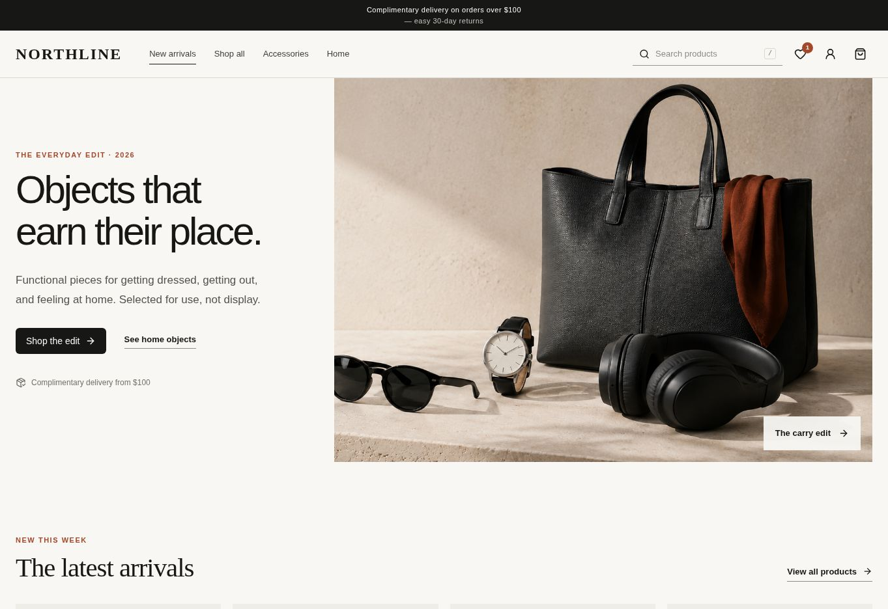
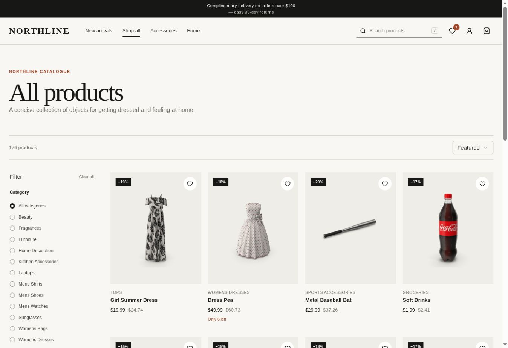
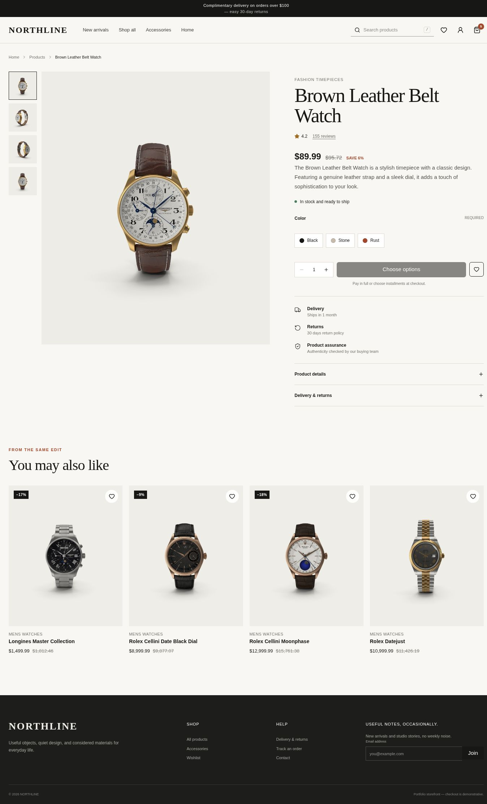
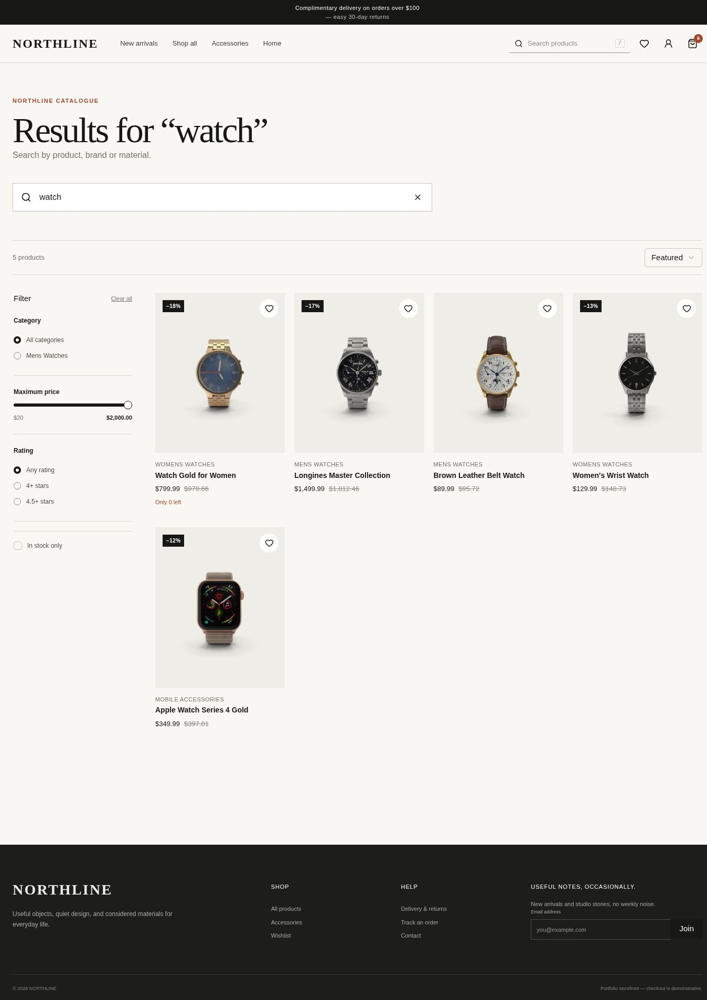
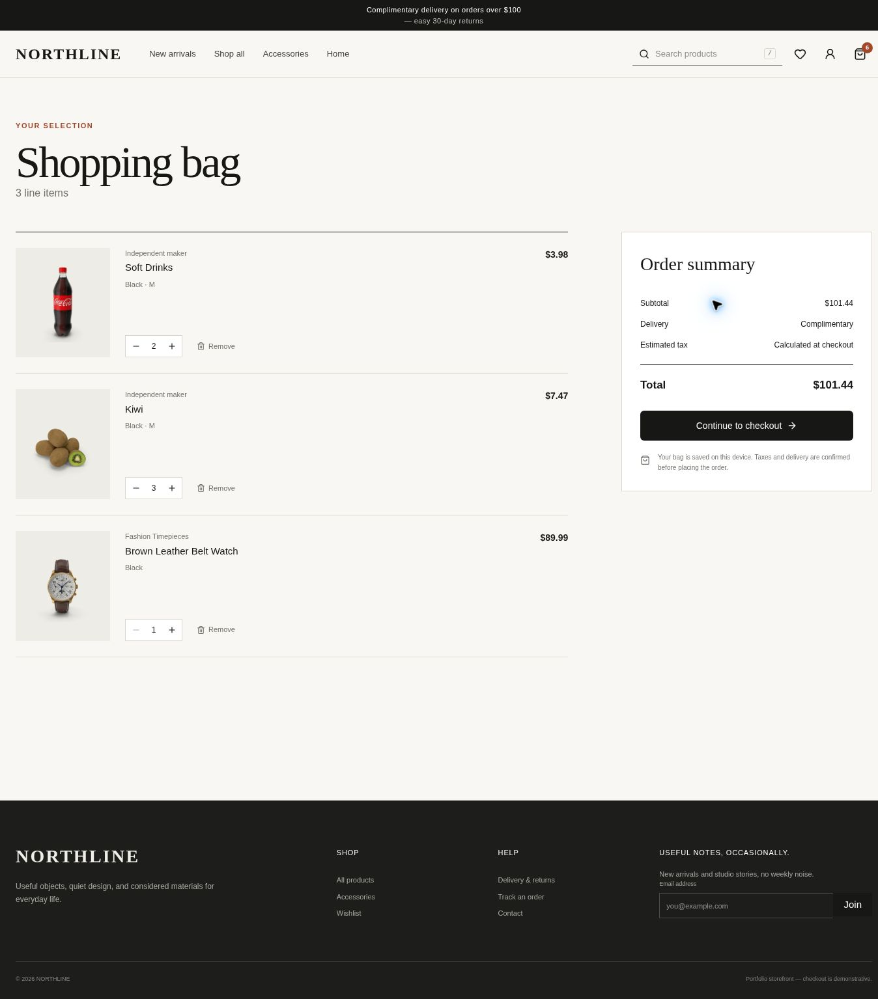
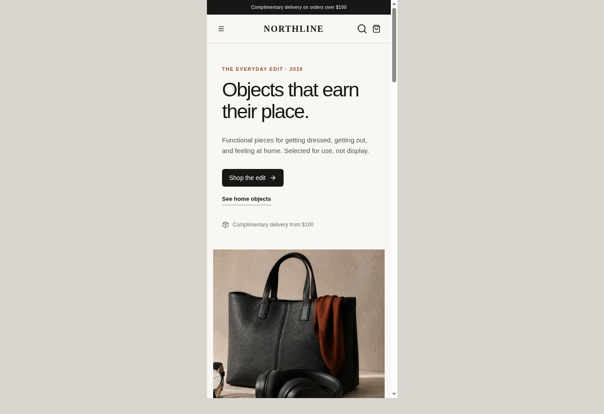
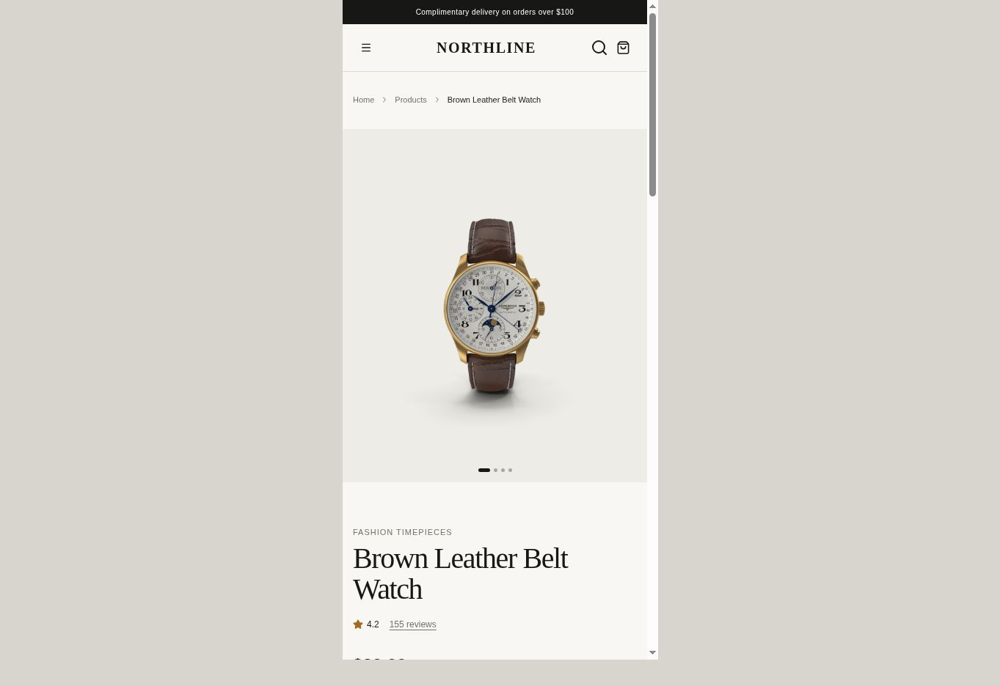
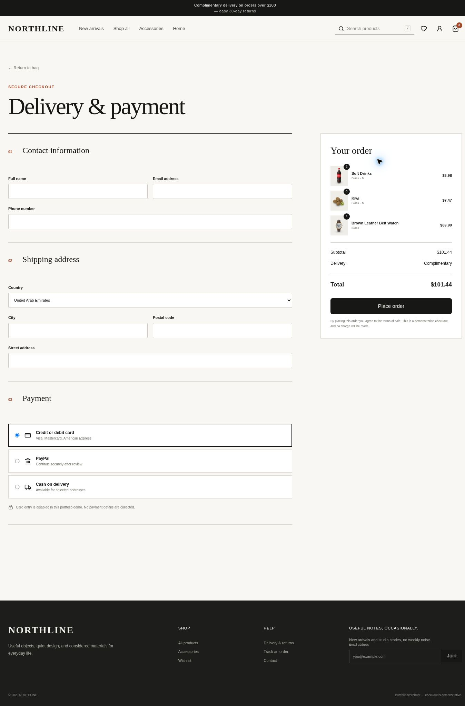

# NORTHLINE Store

NORTHLINE is a modern ecommerce frontend built with React and TypeScript. It focuses on practical shopping flows, responsive design, accessible interactions, persistent client state, and a clean retail-inspired interface.

The project includes a complete product browsing and purchase experience, from catalogue discovery and search to cart management, checkout, order confirmation, and account history.

**Live demo:** [https://github.com/ahmadkali1/storeproject.git](https://github.com/ahmadkali1/storeproject.git)



---

## Features

- Product catalogue powered by the DummyJSON Products API
- Local fallback data when the public API is unavailable
- Debounced product search with request cancellation
- Search queries reflected in the URL
- Category, price, rating, and availability filters
- Multiple sorting options
- Responsive product gallery
- Product color, size, and storage variants
- Disabled and out-of-stock variant states
- Persistent shopping cart
- Persistent wishlist
- Recently viewed products
- Zustand state persistence with LocalStorage
- Optimistic cart and wishlist interactions with rollback support
- Quantity and stock limits
- Dynamic order totals
- Free-delivery threshold
- Checkout form validation
- Credit card, cash on delivery, and PayPal interface options
- Order confirmation flow
- Account profile
- Persistent demonstration order history
- Loading skeletons
- Error states
- Empty states
- Responsive layouts from mobile to large desktop
- Keyboard-friendly navigation
- Visible focus states
- Semantic HTML and accessible form controls
- Reduced-motion support

---

## Screenshots

### Desktop

| Catalogue | Product Detail |
| --- | --- |
|  |  |

| Search | Shopping Bag |
| --- | --- |
|  |  |

### Mobile

| Home | Product Detail |
| --- | --- |
|  |  |

### Checkout



---

## Tech Stack

- React 19
- TypeScript
- Vite 8
- Vinext
- Zustand
- Tailwind CSS 4
- Radix UI
- React Hook Form
- Zod
- Lucide React
- Sonner
- DummyJSON Products REST API
- LocalStorage

---

## Project Structure

```text
app/
├── route entry points
├── page metadata
└── global styles

components/
├── store/
│   ├── storefront views
│   └── reusable ecommerce components
└── ui/
    └── shared interface primitives

src/
├── hooks/
│   ├── product data hooks
│   └── reusable utility hooks
├── services/
│   ├── product API
│   └── mutation services
├── store/
│   └── persistent Zustand state
├── types/
│   └── domain models
└── utils/
    └── formatting and shared helpers

docs/
└── screenshots/

public/
└── static assets
```

The route layer is kept lightweight while page behavior is handled by focused view components.

Remote catalogue requests are centralized in:

```text
src/services/productsApi.ts
```

Shopping cart, wishlist, recently viewed products, and order state are managed through:

```text
src/store/shopStore.ts
```

This keeps UI components separated from data fetching and application state logic.

---

## Application Routes

| Route | Description |
| --- | --- |
| `/` | Home, featured products, categories, and recently viewed products |
| `/products` | Product catalogue, filters, sorting, and load more |
| `/products/:id` | Product gallery, variants, details, and recommendations |
| `/search?q=` | Product search results |
| `/cart` | Shopping cart and order summary |
| `/wishlist` | Saved products |
| `/checkout` | Delivery and payment form |
| `/order-success` | Order confirmation |
| `/account` | Account overview |
| `/account/orders` | Order history |

---

## Search

Product search uses a debounce delay to avoid unnecessary requests while the user is typing.

Previous requests are cancelled using `AbortController`, preventing outdated responses from replacing newer search results.

Search state is also reflected in the URL:

```text
/search?q=shirt
```

This makes search results easier to revisit and share.

---

## Product Filtering and Sorting

The catalogue supports filtering by:

- Category
- Price
- Rating
- Availability

Available sorting options include:

- Featured
- Price: Low to High
- Price: High to Low
- Highest Rated
- Newest

Search, filters, and sorting can be combined.

---

## State Management

Application state is managed with Zustand.

The following data is persisted locally under the `northline-shop` storage key:

- Cart items
- Selected product variants
- Wishlist products
- Recently viewed products
- Completed demonstration orders
- Latest order receipt

This allows shopping state to survive page refreshes and browser restarts.

---

## Optimistic Updates

Cart and wishlist actions update the interface immediately instead of waiting for the mutation layer to complete.

Supported actions include:

- Add to cart
- Remove from cart
- Update quantity
- Add to wishlist
- Remove from wishlist

If an operation fails, the previous state can be restored and feedback is displayed to the user.

---

## Data Layer

Product requests are centralized inside:

```text
src/services/productsApi.ts
```

The application uses the DummyJSON Products REST API as its primary catalogue source.

Abort signals are used to cancel stale requests, and a curated local fallback keeps catalogue pages usable if the public API becomes temporarily unavailable.

Fetch logic is not duplicated across page components.

---

## Checkout

The checkout flow includes:

### Contact Information

- Full name
- Email
- Phone number

### Shipping Address

- Country
- City
- Address
- Postal code

### Payment Methods

- Credit Card
- Cash on Delivery
- PayPal

Form state is handled with React Hook Form and validated using Zod.

The checkout is a demonstration flow and does not process real payments or store card information.

---

## Accessibility

NORTHLINE includes several accessibility-focused improvements:

- Semantic page landmarks
- Skip navigation link
- Visible keyboard focus indicators
- Form labels
- Inline validation messages
- Image alternative text
- Accessible buttons
- Selected and disabled variant states
- Keyboard-operable menus and controls
- Logical heading hierarchy
- Appropriate text contrast
- `prefers-reduced-motion` support

---

## Responsive Design

The interface is designed for a wide range of screen sizes, including:

- 320px
- 375px
- 430px
- 768px
- 1024px
- 1280px
- 1440px and larger

The experience adapts beyond simply changing grid columns, including mobile navigation, compact cart layouts, responsive filtering, checkout layouts, and product gallery behavior.

---

## Local Development

### Requirements

- Node.js 22.13 or newer
- npm 10 or newer

### Installation

```bash
git clone https://github.com/ahmadkali1/storeproject.git
cd storeproject
npm install
```

### Start Development Server

```bash
npm run dev
```

Open the local URL displayed in the terminal.

---

## Quality Checks

Run TypeScript validation:

```bash
npm run typecheck
```

Run tests:

```bash
npm test
```

Create a production build:

```bash
npm run build
```

---

## Production Build

The application can be compiled for production using:

```bash
npm run build
```

The resulting production output is generated inside:

```text
dist/
```

---

## API

NORTHLINE uses the DummyJSON Products API for product catalogue data.

Product information includes:

- Titles
- Descriptions
- Pricing
- Discounts
- Ratings
- Stock
- Categories
- Product images

Additional storefront-specific variant information is handled within the application where required.

---

## Design Approach

NORTHLINE uses a restrained retail-focused visual system with emphasis on:

- Product imagery
- Clear typography
- Consistent spacing
- Limited color usage
- Lightweight borders
- Subtle interaction states
- Responsive layouts
- Simple navigation
- Clear product hierarchy

The interface prioritizes product discovery and purchase actions without unnecessary visual effects.

---

## Future Improvements

Potential future additions include:

- User authentication
- Backend order storage
- Real payment integration
- Server-side cart synchronization
- Product reviews
- Address management
- Inventory synchronization
- End-to-end checkout testing
- Expanded automated test coverage

---

## License

Created as a frontend development portfolio project.

Product names, catalogue data, and product imagery are provided by DummyJSON for demonstration purposes.
